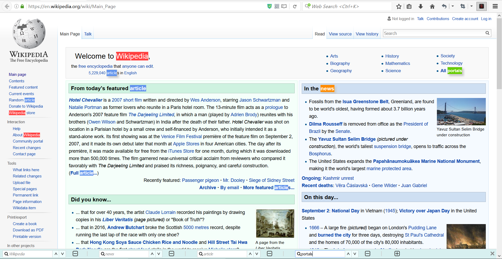

# MultiFinder
MultiFinder is an extension for Firefox and Chrome that supports multi-keyword search, which is more powerful than the built-in search function

## Firefox Demo
### A simple usecase on Wikipedia:

### Also, you can add or remove search boxes as you like:

You can remove all search boxes like this:

Or, you can keep only one search box like the built-in behavior:

Or, you can add as many search boxes as you like:

With two search boxes:

With three search boxes:

With four search boxes:

## Miscellaneous
You can download the Firefox version from [releases](https://github.com/DeliciousGarfield/MultiFinder/tree/master/release). Chrome version will soon be available.
